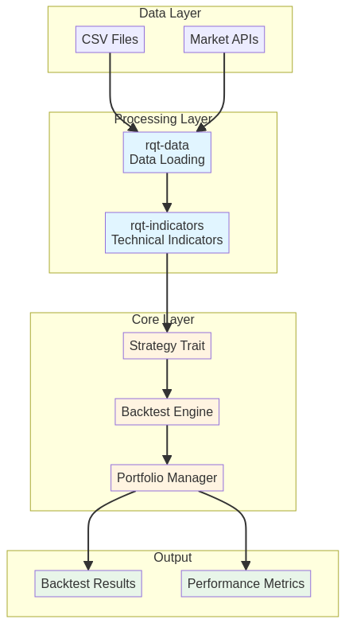
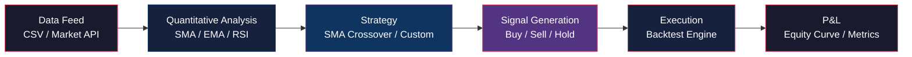

<p align="center">
  
  <br/>
  
</p>

<p align="center">
  
  
  
  
</p>

<div align="center">
  <h3>🚀 A high-performance quantitative trading framework built in Rust</h3>
  <p>Develop, backtest, and optimize trading strategies with blazing speed and type safety</p>
</div>

---

## 📝 Description

`Quantitative-trading` is a robust open-source framework for building quantitative trading strategies. Developed in Rust, it delivers **high performance**, **strong type safety**, and a **modular architecture** for efficient market analysis, technical indicator computation, and strategy backtesting.

### ✨ Key Features

* 🎯 **Efficient Backtesting Engine** - Simulate strategies with historical data
* 📈 **Technical Indicators** - SMA, EMA, RSI implemented natively
* 💾 **Data Management** - Integration with market APIs and CSV
* 🏗️ **Modular Architecture** - Cargo workspace with independent crates
* ⚡ **High Performance** - Leverage Rust's speed

---

## 🚀 Quick Start

### Prerequisites

* [Rust](https://www.rust-lang.org/tools/install) 1.70+
* Git

### Installation

```bash
# Clone the repository
git clone https://github.com/anuragpy07/quantitative-trading-rust.git
cd quantitative-trading-rust

# Run the SMA crossover example
cargo run --example sma_crossover
```

### Example Output

```
Loaded 20 rows of data

Backtest Results:
shape: (20, 1)
┌──────────────┐
│ equity_curve │
│ ---          │
│ f64          │
╞══════════════╡
│ 10000.0      │
│ 10000.0      │
│ 10000.0      │
│ ...          │
└──────────────┘
```

---

## 📚 Usage Example

### Creating a Simple Moving Average Strategy

```rust
use rqt_indicators::sma;
use rqt_core::{Backtest, Strategy};
use polars::prelude::*;

struct SmaCrossover {
    short_window: usize,
    long_window: usize,
}

impl Strategy for SmaCrossover {
    fn generate_signals(&self, data: &DataFrame) -> DataFrame {
        let close_series = data.column("close").unwrap();
        let close: Vec<f64> = close_series.f64().unwrap()
            .into_no_null_iter().collect();

        let short_sma = sma(&close, self.short_window);
        let long_sma = sma(&close, self.long_window);

        // Generate buy/sell signals based on SMA crossover
        // ...
    }
}

fn main() {
    let data = CsvReader::from_path("data/sample_data.csv")?.finish()?;
    let strategy = Box::new(SmaCrossover { 
        short_window: 5, 
        long_window: 10 
    });
    
    let mut backtest = Backtest::new(data, strategy, 10000.0);
    backtest.run();
    
    println!("{}", backtest.results());
}
```

---

## 🏗️ Architecture

The project follows a modular workspace structure with clear separation of concerns:

<div align="center">
  
</div>



### Project Structure

```
quantitative-trading-rust/
├── crates/
│   ├── core/          # Backtesting engine & portfolio management
│   ├── data/          # Data loading & API integrations
│   ├── indicators/    # Technical indicators library
│   └── utils/         # Logging & utilities
├── examples/          # Example strategies
├── data/              # Sample data files
└── docs/              # Documentation & images
```

### Crate Descriptions

| Crate              | Description                                           |
| ------------------ | ----------------------------------------------------- |
| **rqt-core**       | Backtesting engine, position tracking, strategy trait |
| **rqt-data**       | Data loading from CSV and external APIs               |
| **rqt-indicators** | Technical indicators (SMA, EMA, RSI)                  |
| **rqt-utils**      | Logging and utility functions                         |

---

## 📊 Supported Indicators

* ✅ **SMA** (Simple Moving Average)
* ✅ **EMA** (Exponential Moving Average)
* ✅ **RSI** (Relative Strength Index)
* 🔜 **MACD** (Moving Average Convergence Divergence)
* 🔜 **Bollinger Bands**
* 🔜 **Stochastic Oscillator**

---

## 🛣️ Roadmap

* [ ] Add more technical indicators (MACD, Bollinger Bands, Stochastic)
* [ ] Implement advanced backtesting features (slippage, commissions)
* [ ] Add risk management modules (stop-loss, position sizing)
* [ ] Integration with live trading APIs (Binance, Interactive Brokers)
* [ ] Performance metrics (Sharpe Ratio, Sortino, Max Drawdown)
* [ ] Web dashboard for strategy visualization
* [ ] Machine learning integration for signal prediction

---

## 🤝 Contributing

Contributions are welcome! Feel free to submit a Pull Request.

1. Fork the repository
2. Create your feature branch (`git checkout -b feature/AmazingFeature`)
3. Commit your changes (`git commit -m 'Add some AmazingFeature'`)
4. Push to the branch (`git push origin feature/AmazingFeature`)
5. Open a Pull Request

---

## 📜 License

This project is licensed under the MIT License - see the [LICENSE](LICENSE) file for details.

---

## 👨‍💻 Author

**Anurag Kumar**
* 💼 Quantitative Researcher | Problem Solver | Software Developer
* 🔗 https://github.com/anuragpy07

---

## 🙏 Acknowledgments

* Built with Rust
* Data processing with Polars
* Inspired by quantitative finance best practices

---

<div align="center">
  <p>Made with ❤️ and Rust</p>
  <p>⭐ Star this repository if you find it useful!</p>
</div>
